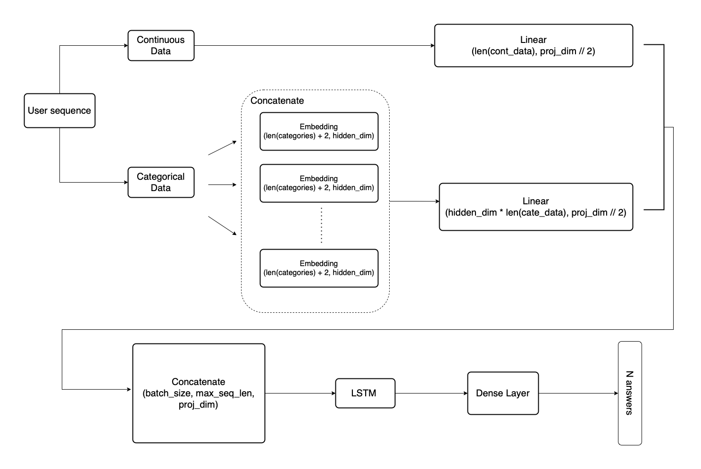

🎮 Student Gameplay Prediction by LSTM 📈
==============================

- Kaggle [Predict Student Performance from Game Play](https://www.kaggle.com/competitions/predict-student-performance-from-game-play/overview) 대회에 참여하였습니다.  
- 유저의 게임 기록을 순서대로 추적하는 것이 학습 상태 파악에 적합하다고 판단, sequential model을 이용하는 방향으로 접근했습니다.
- LSTM을 이용하여 사용자의 게임 로그를 embedded sequence data로 변환, 정답여부를 예측하였습니다.
- LSTM으로 LB f1-score를 0.671으로 향상하였습니다

### Ongoing
- LB에서 점수가 낮아 CV의 overfitting이 우려됨. 모델의 complexity를 줄이고 일반화 성능을 높이는 중

Project Organization
------------

    Gameplay Prediction Project 
        ├── data
        │   ├── processed      <- processing 된 train, test 및 encoder, scaler 데이터
        │   └── raw            <- Kaggle 에서 제공하는 Raw 데이터셋
        │ 
        ├── models             <- 훈련시킨 DNN, LSTM 모델 .pt 파일
        ├── EDA_notebook       <- Exploratory Data Analysis (EDA) 진행한 Jupyter notebook 
        │
        ├── requirements.txt   <- 프로젝트 관련 가상환경 설정 (패키지)               
        │
        └── src                <- Source code for use in this project.
            │
            ├── data           
            │   └── dataloader.py  <- 모델에 넣기 위한 데이터 전처리 관련 코드
            │
            ├── models         
            │   │                      
            │   ├── criterion.py   <- loss 계산 
            │   ├── metric.py      <- 성능지표 계산 
            │   ├── model.py       <- import 할 모델의 모음
            │   ├── optimizer.py   <- Adam 등 optimizer 모음
            │   ├── scheduler.py   <- 학습 스케쥴러 모음
            │   └── trainer.py     <- 모델 훈련, 검증 스크립트
            │
            ├── args.py            <- parse 할 argument 모음                            
            │
            ├── train.py           <- 실행 코드 (main)
            │
            └── utils.py           <- 부가 기능

--------


## Model Schema


## How to execute
```
python src/train.py [--args]
```
